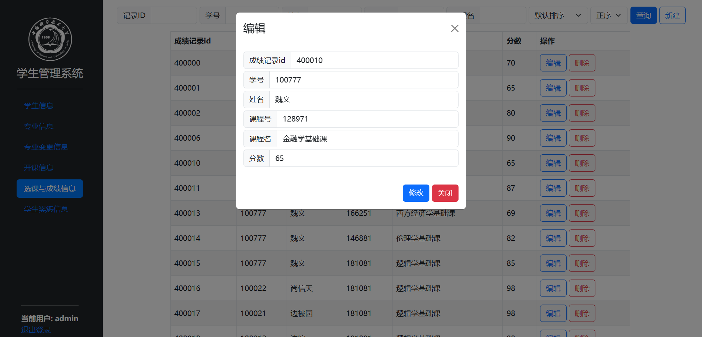

## 数据库实验报告

**成员：** 

**分工：**

---

### 实验选题：学籍管理系统

学生学籍管理系统是一种用于管理和维护学生学籍信息的软件系统，旨在帮助学生或教师管理学生的学籍信息，包括学生的基本信息、课程信息、成绩信息、奖惩信息等，以帮助学业发展.

### 功能需求分析：
  - 学生信息管理：包括学生基本信息录入、修改、查询和删除等功能.
  - 课程管理：包括课程信息录入、查询和修改等功能.
  - 选课管理：学生进行选课、退课和课程查询等操作.
  - 成绩管理：录入和查询学生成绩.
  - 奖惩管理：记录和管理学生的奖励和处罚情况.
  - 班级和专业管理：班级和专业信息的维护和管理.

### 设计分析：
  - 基本实体有学生，班级，专业，课程，教师，成绩，奖惩，专业变更等.
  - 学生从属班级，学生从属专业，为N-1关系.
  - 学生选课，为M-N关系.成绩由学生和课程决定.
  - 教师授课，为1-N关系，认为同一教师可教授多门课程.
  - 认为专业变更和奖惩记录为弱实体，依赖于学生，学生与其是1-N关系.

### ER图：

每个实体都有唯一的ID标记元组，是3NF的

### MySQL 设计：

- 基本表
  - `awardsandpentalties`( <u>record_id</u> ,student_id,type,reason,app_date) 奖惩信息表
  - `class`(class_id,class_teacher,class_name) 班级表
  - `coursegrades`(<u>grade_record_id</u>,student_id,course_id,grade) 选课和成绩表
  - `coursemanagement`(<u>course_id</u>,course_name,credits,hours,teacher,exam_time,exam_location,semester,college_name) 开课信息表
  - `major`(<u>major_id</u>,major_name) 专业表
  - `majorchange`(<u>major_record_id</u>,student_id,previous_major_id,current_major_id,change_date) 专业变更表
  - `studentbasicinfo`(<u>student_id</u>,name,gender,age,birthdate,hometown,enrollment_date,major_id,class_id) 学生基本信息表
- 视图 
  - `student_info`: 连接了学生表、班级表、专业表的视图
  - `major_change_info`: 连接了专业变更表、学生表、专业表的视图
  - `grade_info`: 连接了学生表、课程表、成绩表的视图
  - `awards_info`: 连接了学生表、奖惩表的视图
- 存储过程
  - 删除过程：`delAward`, `delCG`, `delStu`, 分别对应了删除奖惩、成绩、学生的过程；删除学生时会级联删除学生的所有信息，包括选课，成绩，奖惩等
  - 编辑过程：`editAward`, `editCG`, `editStu`, `editClass`,`editCM`,`editMajor`,分别对应了编辑奖惩、成绩、学生、班级、课程、专业的过程
  - 插入过程：`insertAward`, `insertCG`, `insertStu`, `insertClass`,`insertCM`,`insertMajor`,分别对应了插入奖惩、成绩、学生、班级、课程、专业的过程
- 触发器
  - 提供了触发器可以在更改学生的出生日期时自动推算年龄，也可以在新建学生时触发
  - 当编辑专业时，会在专业变更表中添加一条记录，记录学生的专业变更情况

### 前后端设计：
采用B/S架构，前端使用HTML+Bootstrap+JavaScript，后端使用Flask连接数据库和前端

**对于本系统的用户，权限分为学生和管理员两种，账户和密码采用哈希存储，并做了salt随机加密，保证了安全性。**

**另外在设计过程中，对于前端的输入内容做了检查，防止了SQL注入，保证了安全性。**

 --- 

### 系统功能：
#### 管理员账户：

- **学生信息管理：** 为学生表、班级表、专业表的连接查询

**检索学生信息：** 提供了所有属性详细的检索，字符串类型可以模糊检索，日期和数字类型可以范围检索，并提供了所有的属性排序

**编辑学生信息：** 当编辑专业之后，会在专业变更表中添加一条记录，记录学生的专业变更情况

**删除学生信息：** 提供了二次确认，删除后会删除学生的所有信息，包括选课，成绩，奖惩等

**新建学生信息：** 学号递增自动生成，不可指定，不会重复

- **专业管理**

**新建专业：** 可以指定专业编号，编号重复时提示不可重复

**编辑专业：** 只可更改专业名称

- **专业变更信息：** 此表在编辑学生专业时自动生成，不可编辑

- **开课信息**

**详细检索：** 提供了同样丰富详细的检索

**新建课程：** 可以指定课程号，编号重复时提示不可重复

**编辑课程：** 

- **选课和成绩管理：** 所有学生的选课和成绩信息

**成绩分布图：** 可以查看指定课程或者指定学生的成绩分布图

**新建选课和成绩：** 提供了即时检索，通过学号/姓名来检索学生，课程号/课程名检索课程，新建条目的学号和课程号由筛选的下拉菜单确定，不会出现不存在学生或课程的情况

**编辑选课和成绩：** 

**删除选课和成绩：** 提供了二次确认

- **奖惩信息管理：** 所有学生的奖惩信息：提供了新建、编辑和删除功能

#### 学生账户：
- **学生信息管理：** 只能查看自己的信息，不可编辑

- **专业变更信息：** 只能查看自己的信息，不可编辑

- **开课信息：** 提供了选课功能，新选的课成绩默认为0

- **选课和成绩管理：** 只能查看自己的信息，提供退课功能

**成绩分布图：** 可以查看自己所选课程的成绩分布图

- **奖惩信息管理：** 只能查看自己的信息，不可编辑

---

### 项目总结：
- 通过本次项目，对数据库的设计有了更深的理解，对于数据库的设计原则有了更深的认识，对于数据库的设计也有了更深的理解
- 通过本次项目，对于SQL语句的使用有了更深的理解，对于SQL语句的优化也有了更深的认识
- 理解了前后端开发的基本流程
- 受益匪浅